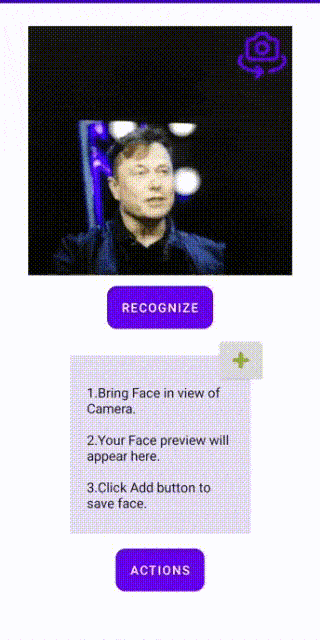
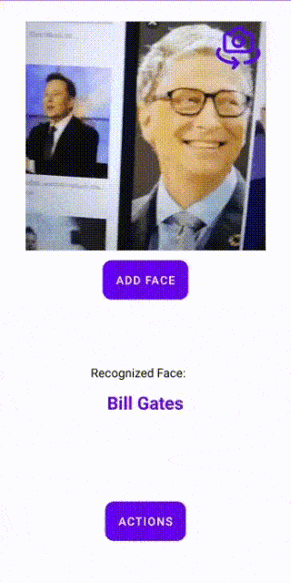
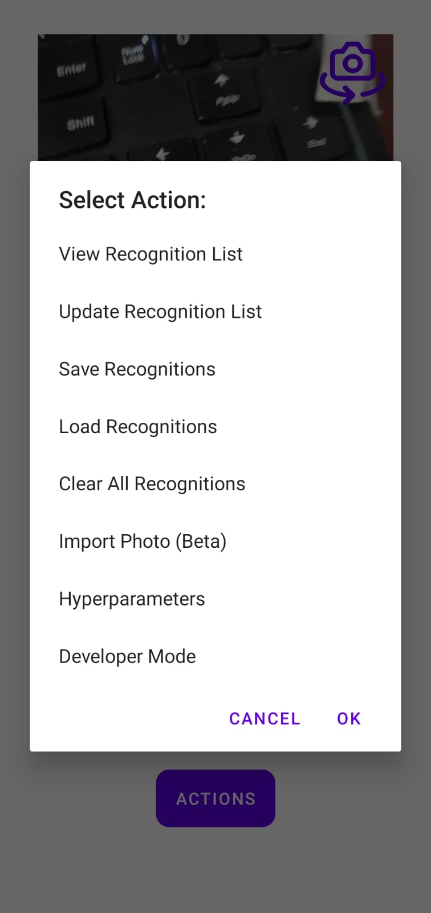
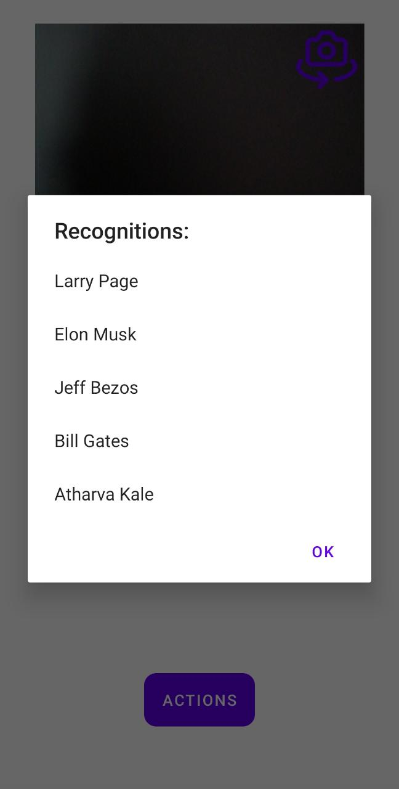
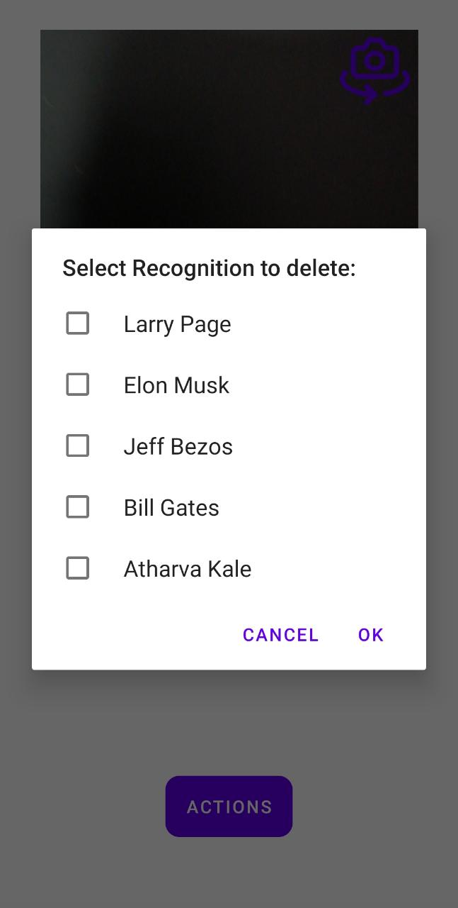

# Real Time Face Recognition using TfLite
This project is developed with the aim that the user should be able to implement this Face recognition module inside any other application where Face Recognition is required without any additional requirements.
## Key Features 
- Fast and very accurate.
- No re-training required to add new Faces.
- Save Recognitions for further use.
- Real-Time and offline.
- Simple UI.

## Tools and Frameworks used:
- Android Studio (Java)
- CameraX
- ML Kit
- TensorFlow Lite

## Model 
- MobileFaceNet : [Research Paper](https://arxiv.org/ftp/arxiv/papers/1804/1804.07573.pdf)
- [Implementation](https://github.com/sirius-ai/MobileFaceNet_TF)

## Installation

Use Import from Version Control in Android Studio or Clone repo and open the project in Android Studio.

```bash
git clone https://github.com/atharvakale31/Face_Recognition.git
```

## Usage
- Add Face

- Recognize Face

- Actions





## Contributing
Pull requests are welcome. For major changes, please open an issue first to discuss what you would like to change.

Please make sure to update tests as appropriate.

